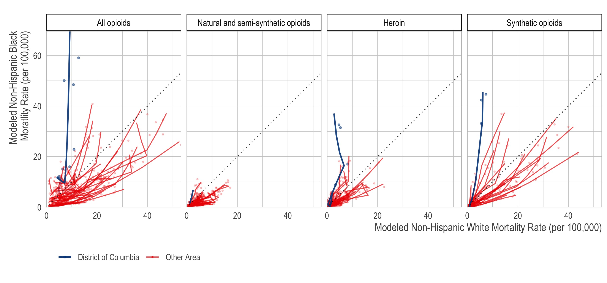

<!-- README.md is generated from README.Rmd. Please edit that file -->

```{r, include = FALSE}
knitr::opts_chunk$set(
  collapse = TRUE,
  comment = "#>"
)
```
# Increasingly disproportionate opioid-related deaths among non-Hispanic Black Americans in Washington DC, 1999-2018

```{r echo=FALSE, out.width = "700px", fig.align='center'}

```

This is reproducible code for our paper ["Increasingly disproportionate opioid-related deaths among non-Hispanic Black Americans in Washington DC, 1999-2018"](LINK), which uses [restricted-access multiple cause of death data](https://www.cdc.gov/nchs/nvss/nvss-restricted-data.htm) to examine racial/ethnic disparities in the trajectory of opioid-related deaths by state. The full citation is:

> Kiang MV, Tsai AC, Alexander MJ, Rehkopf DH, and Basu S, Increasingly disproportionate opioid-related deaths among non-Hispanic Black Americans in Washington DC, 1999-2018. Forthcoming. doi: [TKTKTK](TODO)

## Abstract

In 2018, there were nearly 47,000 opioid-related deaths in the US, with substantial variation across sociodemographic groups and geography. To understand the disproportionate burden of opioid-related mortality among Black adults, we used joinpoint regression models to estimate the trajectory of the opioid epidemic among non-Hispanic Black versus non-Hispanic white residents in 33 states and Washington DC. In 2018, Black DC residents had seven times higher opioid-related mortality compared with white DC residents (50.1 vs. 7.0 per 100,000), and the opioid-related mortality rate was increasing nearly ten times as rapidly among Black DC residents compared to white DC residents (39% per year, 95% CI: 20, 61; P < .001, versus 4% per year, 95% CI: 1, 8; P < .001). Localized, equitable, culturally-appropriate, targeted interventions may be necessary to reduce the disproportionate burden of opioid-related mortality among Black DC residents. 

## Interactive results explorer 

Our paper highlights the case of Washington DC; however, all results for all 33 states in our analysis can be viewed through the online interactive results viewer located here: [`https://mkiang.shinyapps.io/opioid_inequities/`](https://mkiang.shinyapps.io/opioid_inequities/). You can run the app on your local environment using [RStudio](https://rstudio.com/) by running `shiny::runGitHub("mkiang/opioid_inequities")`. This interactive results viewer contains additional information, such as model estimates and fit statistics. 

## Issues
Please submit issues [via Github](https://github.com/mkiang/opioid_inequities/issues) or via email.

## Important note about reproducibility 
In accordance with our data use agreement with the National Center for Health Statistics, we cannot share all data. When possible, we provide raw data as well as estimated data. In the cases where observations have fewer than 10 deaths, we suppress the rate. This restriction means this pipeline is not fully reproducible without the restricted-access data. (See *Requirements*.)

# Requirements
## Restricted-access multiple cause of death data
Unfortunately, for years after 2004, the [multiple cause of death](https://www.cdc.gov/nchs/nvss/nvss-restricted-data.htm) data do not include geographic identifiers. Therefore, state-level analysis using the public-access data is not possible. To get restricted data, you must apply through [NVSS](https://www.cdc.gov/nchs/nvss/nvss-restricted-data.htm#anchor_1553801903). 

If you have the restricted data, they should either (1) in a subfolder named `./data_private/` with the following names, *or* (2) you must modify the `regex` command on line 33 of `./code/01_retrieve_opioid_deaths.R` such that it returns a vector of file paths to the restricted-access data. The vector should look like something below: 

```r
fs::dir_ls("./data_private/")
#> ./data_private/MULT1999.AllCnty.zip
#> ./data_private/MULT2000.AllCnty.zip
#> ./data_private/MULT2001.AllCnty.zip
#> ./data_private/MULT2002.USPSAllCnty.zip
#> ./data_private/MULT2003.USPSAllCnty.zip
#> ./data_private/MULT2004.USPSAllCnty.zip
#> ./data_private/MULT2005.USPSAllCnty.zip
#> ./data_private/MULT2006.USPSAllCnty.zip
#> ./data_private/MULT2007.USPSAllCnty.zip
#> ./data_private/MULT2008.USPSAllCnty.zip
#> ./data_private/MULT2009.USPSAllCnty.zip
#> ./data_private/MULT2010.USPSAllCnty.zip
#> ./data_private/MULT2011.USPSAllCnty.zip
#> ./data_private/MULT2012.USPSAllCnty.zip
#> ./data_private/MULT2013.USPSAllCnty.zip
#> ./data_private/MULT2014.USPSAllCnty.zip
#> ./data_private/MULT2015.USPSAllCnty.zip
#> ./data_private/MULT2016.USPSAllCnty.zip
#> ./data_private/MULT2017.USPSAllCnty.zip
#> ./data_private/MULT2018.USPSAllCnty.zip
```

## Software

All analyses are conducted using `R`, which can be [downloaded via CRAN](https://cran.r-project.org/), and the Joinpoint Regression Program, which can be [downloaded from the National Cancer Institute](https://surveillance.cancer.gov/joinpoint/). 

We also recommend the use of  [RStudio](https://www.rstudio.com/products/rstudio/download/) when running `R`, which will allow users to take advantage of [`renv`](https://rstudio.github.io/renv/index.html) for dependency management.

# Analysis pipeline
The analysis pipeline is divided into three discrete steps. In (1), we clean, subset, munge, and calculate mortality rates using the raw (restricted-access) data. This results in a working dataframe that contains the data necessary for the joinpoint regression program to fit models for each year, state, and opioid type for the non-Hispanic White and non-Hispanic Black populations. These are held in the `01` to `03` code files. 

In (2), the joinpoint regressions are fit in an external program (NCI Joinpoint Regression Program) and the results are exported. The `./joinpoint_analyses/age_std_rates_long.jpg` file contains our session information to reproduce our analysis and requires the `./joinpoint_analyses/age_std_rates_long.csv` file generated from the step above. 

In (3), the resulting (exported) joinpoint files are combined into a single file for plotting and to create tables. These files are also used for the interactive results viewer. 

All files should be run sequentially. 

# Session information

See `./rmds/session_info.html` for more reproducibility information. 

# Authors (alphabetical)
- [Monica Alexander](http://monicaalexander.com) (: [mjalexander](https://github.com/mjalexander) | : [\@monjalexander](https://twitter.com/monjalexander))
- [Sanjay Basu](https://sites.google.com/stanford.edu/basulab/home?authuser=0) (: [sanjaybasu](https://github.com/sanjaybasu) | : [\@sanjaybmdphd](https://twitter.com/sanjaybmdphd))
- [Mathew Kiang](https://mathewkiang.com) (: [mkiang](https://github.com/mkiang) | : [\@mathewkiang](https://twitter.com/mathewkiang))
- [David Rehkopf](https://profiles.stanford.edu/david-rehkopf) (: [\@drehkopf](https://twitter.com/drehkopf))
- [Alexander Tsai](https://mathewkiang.com) (: [\@drdrtsai](https://twitter.com/drdrtsai))
